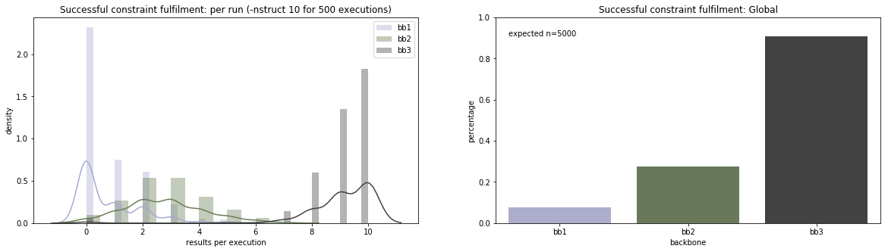
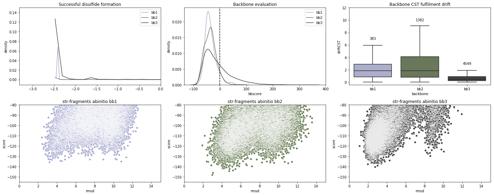
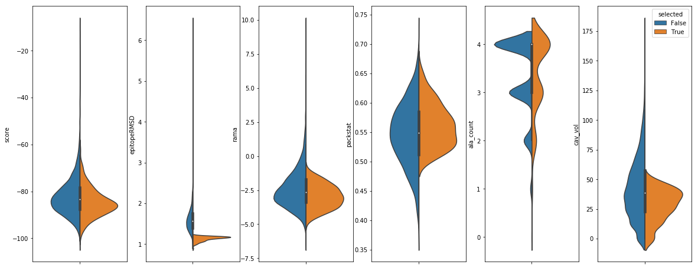

# De novo design procedure for site 0 scaffold

## Template building

_De novo_ parametrically defined secondary structures were build exploiting a new python-based library named [TopoBuilder](https://github.com/LPDI-EPFL/topobuilder/tree/releasepy2). Within TopoBuilder, we built **three** different helical orientations, resulting in **three** distinct parametric topologies around the neutralization epitope site 0. The three different backbones were names S0_2_bb1-bb3, as explained in the manuscript and illustrated below. 

In order to create the different backbones, install TopoBuilder and run: 

``` python -m topobuilder -input $INPUT.json``` (replacing $INPUT with the json configuration file for each backbone (bb1-bb3). 

TopoBuilder generated a _sketch_ and a c-alpha only topology from which constraints and fragments were derived. Both constraints and fragments were used to guide backbone folding with [FunFolDes](https://doi.org/10.1371/journal.pcbi.1006623).

|**S0 epitope (extended)**|**bb1**|**bb2**|**bb3**|
|--------------|-------------|-------------|-------------|
|||||

## Template refolding and backbone selection

The sketches created are used to created C-alpha `atom_pair` constraints to use as input for Rosetta [FunFolDes](https://doi.org/10.1371/journal.pcbi.1006623).

By running FunFolDes, we obtain a continuous, unbroken topology that connects all the defined secondary structures while keeping the motif unmodified. Fragments for the protocol are created for each topology according to a secondary-structure based statistical sequence.

After refolding, we observed several features that tilted the balance towards configuration **bb3** as the most likely to success. Observed features regarding this selection are:

* Arround 90% of all the rounds for **bb3** generated a backbone compatible with the expected constraints. This success drops to around a 30% for **bb2** and under 10% for **bb1**. This level of success can reflect on the viability of the topology.
* **bb3** is more successful in recover the disulfides at the edges of the S0 epitope, doubling the percentage of success of the following configuration **bb2**.
* After a initial naive design process, **bb3** backbone remains more static than the other two, indicating that the folded backbone better accomodate, as they are, a variate number of putative sequences.
* On _ab initio_ analysis of the top selected backbone, **bb3** presents a more coherent funnel than the other two.







## Sequence design of selected topology

Results from backbone folding suggested **bb3** as the one with a higher chance of success. As such, a selected backbone from the population was diversified through flexible backbone design.

The RosettaScript for design is provided [here](design/design_helical_topology.xml). Scoring during the design process is guided by a [weights file](design/talaris2014_highAlanine.wts) that penalizes alanines during the design process, which was required to increase the fraction of residues with larger hydrophobic side chains for improved core packing. Sequences were selected according to multiple parameters, selection criteria are detailed here.


```python
dsg = rstoolbox.io.parse_rosetta_file('design/bb3_designs.minisilent.gz', 
                                      {'scores': ['score', 'epitopeRMSD', 'rama', 'packstat',
                                                  'ala_count', 'cav_vol', 'description'],
                                       'naming': ['', 'bb']})
# Filter and pick
pck = dsg[(dsg["epitopeRMSD"] < 1.2) & (dsg["packstat"] > 0.5) &
          (dsg["rama"] < -1.0) & (dsg["cav_vol"] <50)].sort_values(["packstat"], ascending=False)
dsg = dsg.assign(selected=dsg['description'].isin(pck['description']))

# Show
fig = plt.figure(figsize=(20, 8))
grid = (1, 6)
props = ['score', 'epitopeRMSD', 'rama', 'packstat', 'ala_count', 'cav_vol']
for i in range(6):
    ax = plt.subplot2grid(grid, (0, i))
    sns.violinplot(x='bb', y=props[i], hue='selected', data=dsg, split=True, ax=ax)
    ax.set_xlabel('')
    ax.set_xticklabels([''])
    if i < 5:
        ax.get_legend().remove()
plt.show()
```





The almost 200 structure obtained through this filtering process can be found [here](design/selected).

Following manual inspection, sequences were encoded in oligo libraries, and screened using yeast display, which re-expanded the sequence space explored.
