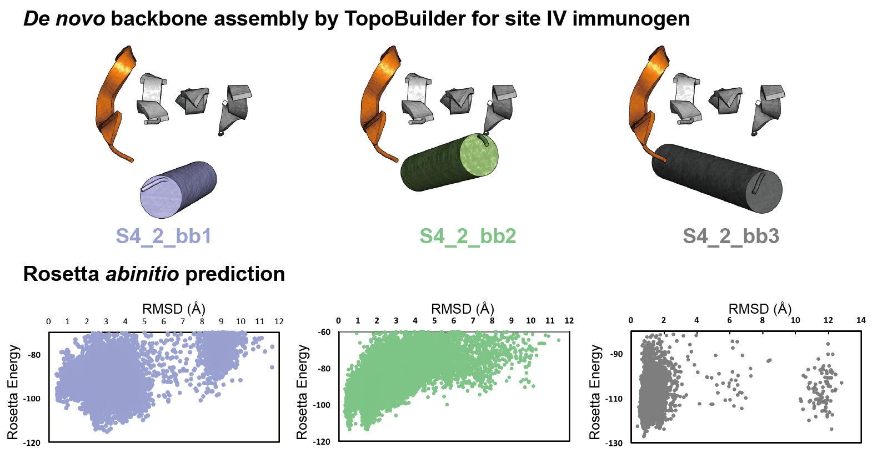

# Assembly of a *de novo* topology to present site IV epitope
To design a scaffold that can stabilize the RSV antigenic site IV (a linear beta strand with a bulge) in its native conformation, a topology consisting of 4 strands and one alpha helix was built using [TopoBuilder](https://github.com/LPDI-EPFL/topobuilder/tree/releasepy2). Within the S4_2 topology, we sampled **three** different helical angles, as described in the [manuscript](https://www.biorxiv.org/content/10.1101/685867v1). 

### Template building - parametric assembly of secondary structural elements (SSEs) and the site IV motif
We built three antiparallel beta strands, pairing with the epitope to form a four-strand β sheet, plus an alpha helix on the buried side to stabilize the sheet. The epitope, three idealized strand and one idealized helix were placed in the structural definition based on the αβα schema as two separate layers. Three different helical orientation (angle 45°, angle -45° and angle (-45°,0°,10°)) with respect to the β-sheet) were defined in json configuration files for [S4_2_bb1](./siteIV_bb1), [S4_2_bb2](./siteIV_bb2), and [S4_2_bb3](./siteIV_bb3). The distance between Cα atoms of β strand was set to 5 Å to resemble the distance found in natural beta sheets and the distance between Cα atoms between two layers was set to 11 Å.

### Building a connection to link SSEs 
In order to form a continuous backbone trace from each defined SSE, the minimal number of residues was chosen as connection, built during the folding and design process using Rosetta FunFolDes. Selected connecting loops were sampled in terms of length and sequence in the yeast library (see manuscript). 

### Folding  centroid-level sketches using Rosetta FunFolDes
Cα atomic constraints were generated from the template sketches to guide the folding process. A FunFolDes script is provided [here](link), decoys with the best Rosetta energy  were inspected manually, and loop connections were optimized using Rosetta Remodel if necessary. We then performed Rosetta ab initio on a small subset of decoys representative of different backbone configurations, as shown    

All three different helical configurations showed a funnel-shaped energy landscape, prompting us to design and test all three topologies.

### Sequence design 
We used the Rosetta protocol LayerDesign to design sequences for three selected backbones. To favour larger hydrophobic amino acids in the protein's core, the scoring function (beta15) was biased in weighting total hydrophobicity by 1.0 units to penalize sequences with low percentage of non-polar amino acids and the overall fraction of Ala and Val was restricted to less than 15 % of total amino acids, as defined in an aa_composition file. In order to reinforce the proper strand-pairing for antiparallel β sheet, the SheetConstraintGenerator was applied to favour a local geometry forming backbone hydrogen bond.
At the beginning of the design step, a minimization was performed to perturb the local geometry of the backbone, and then searched all positions for potential disulphide formation (using Disulfidize mover). After searching the sterically possible combinations of disulphide bonds for a given backbone, the following sequence design was performed by using the FastDesign mover to automatically design the entire backbone based on the layer definition . In order to select the best sequences for experimental screening, the designs were evaluated by a customized filter metric provided [here](./sequence_design/siteIV_bb1_design/siteIV_bb1_design_selection.ipynb). 
